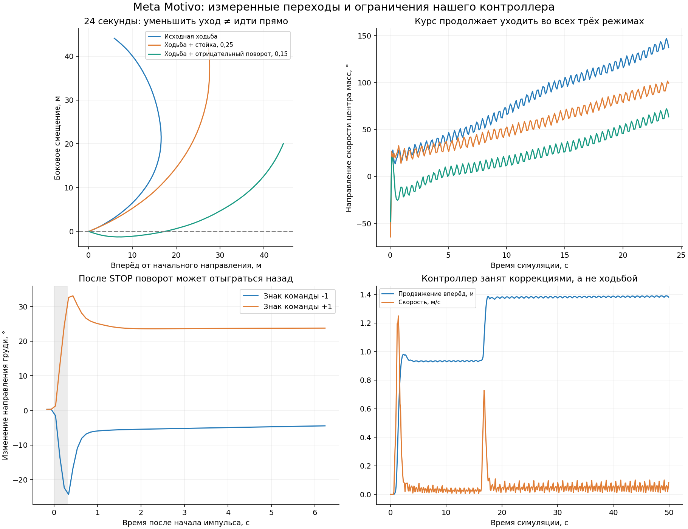

# Local Character Lab — локальный ИИ-персонаж на ПК

**Статус на 17 сентября 2026: экспериментальный дневник, не готовый продукт и не рейтинг моделей.**

Исследуем, как связать локальную языковую модель с управляемым персонажем: понимание русских команд → ограниченный API действий → навигация → нейросетевая анимация. Публикуем измерения, неудачи и исправления, чтобы другим не пришлось повторять все ошибки.

Работа велась совместно пользователем на Windows и ИИ-ассистентом с отдельной Linux-средой. Код и анализ подготовлены с помощью ИИ; это не независимая лабораторная экспертиза. Мы различаем реальные запуски, тестовые заглушки и сведения из чужих публикаций.

## Коротко: что получилось

- **AI4AnimationPy на CPU:** pretrained-модель анимации работает на пользовательском ПК; пользователь оценил движение как плавное. Нового обучения не было.
- **Навигация v2:** код задаёт перемещение корня, нейросеть адаптирует позу к траектории. Исправлены лишние остановки на поворотах, вызванные нашим навигатором, а не нейросетью.
- **Связь с настоящим Qwen:** русская команда привела к выбору `goto`, подходу персонажа и завершению задания.
- **Главный провал первого агентного теста:** 58,51 с на первое решение и 70,50 с на финальный ответ. Для интерактивного персонажа непригодно.
- **Скрытый дефект этого же теста:** испорченная кодировка названий объектов и системных строк. По нему нельзя честно оценивать нормальное качество русского у модели.
- **Поиск другого мозга:** пока исследование источников. Qwen3.5/3.6/3.8 и уменьшенные REAP-модели в нашей связке ещё не тестировались.

## Подробнее: что показали тесты Meta Motivo

До нынешней связки мы подробно проверяли Meta Motivo S-1 на CPU: от базовых движений до переходов, остановок и замкнутых маршрутов. В большом наборе **из 91 запланированного испытания выполнено 79, ещё 12 пропущены**, а не провалены. Получено 28,57 минуты симуляции; сумма времени испытаний — 10,29 минуты, без загрузки модели и межтестовых операций.

Главные результаты:

- Уменьшить уход курса удалось, но устойчивую прямую ходьбу проверенными постоянными смесями не получили.
- Один и тот же короткий импульс поворота сильно зависел от предшествующей ходьбы или стойки.
- Прогноз торможения оказался хуже простого порога: средняя абсолютная ошибка **16,67° против 8,61°**. Причина включала нашу ошибку обработки знака возврата после STOP.
- Шесть выполненных маршрутов не завершились: контроллер большую часть времени выравнивался и останавливался, почти не переходя к ходьбе. Это не доказательство, что исходная модель вообще неспособна проходить маршруты.



*Графики построены по сохранённой телеметрии. Слева сверху — траектории трёх профилей; справа сверху — продолжающийся уход курса; снизу — возврат после остановки и зацикливание нашего stop-go контроллера.*

**[Подробный разбор Motivo, методика и дополнительные графики →](motivo_findings.md)**

Именно эти эксперименты помогли выбрать нынешнюю архитектуру: код задаёт путь корня, а нейросеть адаптирует анимацию. Мы не выдаём смену подхода за исправление Motivo и не приписываем исходной модели все ошибки нашей обвязки.

## Оборудование и разделение сред

### Пользовательский ПК — реальные Windows-тесты

- Windows 10 Pro;
- Intel Core i3-10100F;
- около 16 ГБ RAM;
- NVIDIA P104-100 8 ГБ + GTX 1060 6 ГБ;
- Python 3.12.14, PyTorch 2.14.0 CPU для анимации;
- локальный Qwen использует обе GPU; видеопамять не считается свободной только потому, что загрузка GPU в данный момент низкая.

### Отдельная тестовая среда ассистента

Linux, CPU PyTorch, headless-запуски и графические smoke-тесты через Xvfb. Конфигурация процессора не зафиксирована достаточно для аппаратного сравнения. **Её миллисекунды нельзя переносить на Windows-ПК пользователя.**

## Архитектура

```text
Русское задание
    ↓
Локальная LLM: наблюдение + память увиденного → одно действие
    ↓
Проверка действия и идентификатора объекта
    ↓
Код навигации: путь, столкновения, перемещение корня
    ↓
AI4AnimationPy: адаптация анимации к прогнозу движения
    ↓
IK ног → отображение персонажа
```

Позиция корня управляется кодом. Мы не требуем, чтобы нейросеть физически толкала персонажа силами стоп. Это осознанная архитектура, а не доказательство физического навыка ходьбы.

Восприятие — **семантические данные движка из положения головы**, с ограничением поля зрения, дальности и проверкой перекрытий. Картинка общей камеры не передаётся LLM. Только увиденные объекты получают доступные модели идентификаторы; сохраняется память с возрастом наблюдения.

Внутренний навигатор знает статическую карту препятствий. LLM её не получает. Это ещё не навигация с построением карты из неизвестного окружения.

Действия: `goto`, `look`, `stop`, `set_speed`, `set_style`, `finish`. Произвольные координаты от LLM не принимаются. Запрос к модели асинхронный; остановка пользователем обходит LLM, запоздалое решение отменённого задания не должно возобновлять движение.

## Что и где проверяли

| Компонент | Реальный статус | Вывод |
|---|---|---|
| Meta Motivo | Выполнен большой пользовательский прогон и анализ телеметрии | Непрерывное управление нашим контроллером не подтверждено; обнаружены также ошибки самого контроллера. Ветка остановлена |
| Lucky Robots G1 walker | CPU-испытания в отдельной среде, не на Windows пользователя | 6 конкретных замкнутых маршрутов пройдены; это робот, не доказанный человеческий моторный фундамент |
| PACER | Изучены исходники и условия запуска | Не запускался; практический тест отложен |
| AI4AnimationPy | Linux CPU и пользовательский Windows CPU | Выбрана для текущего тела; веса не переобучались |
| Qwen3-30B-A3B-Thinking-2507 UD-Q2_K_XL | Реально запущен на двух пользовательских GPU вместе со сценой | Действие выполнено, но неприемлемая задержка; наблюдения повреждены кодировкой |
| Qwen3.5/3.6/3.8, REAP/GSQ-RCO | Только изучение опубликованных материалов | Нет наших замеров скорости или качества |

Исторические подробности: [Motivo](motivo_findings.md), [G1 walker](g1_findings.md). Полная исходная телеметрия этих ранних веток не включена в компактный выпуск; эти два документа — аналитические записи, не полный воспроизводимый архив.

## Измерения текущей ветки

### Windows: первый запуск сцены с настоящим Qwen

| Показатель | Значение |
|---|---:|
| Симулированное время | 298,733 с |
| Кадры | 8962 |
| Достигнутые цели | 1 |
| Невалидные положения корня | 0 |
| Срабатывания collision guard | 0 |
| Среднее время обновления тела | 14,105 мс |
| p95 времени обновления | 20,758 мс |
| Средняя работа кадра | 18,184 мс |

Источник: [сводка запуска](windows_agent_v1_summary.json), [покадровая телеметрия](windows_agent_v1_frames.csv). Работа кадра и обновление тела — разные метрики, не полная задержка команды LLM.

### Команда: «Подойди к красному столу обычным шагом»

Из предоставленного пользователем журнала запросов, без публикации полного диалога:

| Этап | Время / результат |
|---|---|
| Первый запрос к Qwen | 58,511 с wall-clock; 1015 completion tokens; 2402 prompt tokens |
| Действие | `goto`, известный идентификатор красного стола |
| Исполнение с финальным разворотом | около 5,33 с симуляции |
| Второй запрос к Qwen | 70,497 с wall-clock; 1512 completion tokens; 2496 prompt tokens |
| Последний ответ | `finish` |

**2527 выходных токенов ради подхода и подтверждения.** Режим Thinking-2507, второй вызов модели после прибытия и повреждённый текст наблюдений не позволяют свести всю задержку к «плохой модели». Данных для выделения чистой скорости декодирования из полного времени HTTP-запроса недостаточно.

### Навигация v1 → v2

Последовательность из пяти целей, отдельный тест навигатора, без LLM:

| Показатель | v1 | v2 |
|---|---:|---:|
| Время симуляции до завершения | 54,967 с | 48,433 с |
| Медленные участки вдали от цели после старта | 1,267 с | 0 с |
| Минимальная скорость в проверяемых поворотах | 0,0298 м/с | 0,5316 м/с |
| Срабатывания защиты от столкновения | 0 | 0 |

Источник: [navigation_comparison.json](navigation_comparison.json). Это тест конкретных маршрутов, не универсальная оценка качества навигации. Коррекция v2: скругление с проверкой свободного места, продвижение по пути независимо от разворота тела, отсутствие торможения у каждой промежуточной точки.

Дополнительные сохранённые сводки Linux/Windows собраны в [measurements.csv](measurements.csv). Короткие Linux-запуски агентной сцены в этой таблице **не использовали настоящий Qwen**.

## Ошибки, которые полезно не повторять

1. **Не обвинять сеть без анализа контроллера.** В v1 скорость подавлялась ошибкой направления и торможением у промежуточных точек. Пользователь правильно заметил, что при ручном управлении такой остановки нет.
2. **Не путать достижение цели с естественным подходом.** Первый агент остановился по диагонали от угла стола. В agent-room-v2 выбирается середина доступной стороны с последующим разворотом.
3. **Проверять кодировку до оценки понимания языка.** В журнале испортились названия предметов, тогда как введённый пользователем текст был нормальным. Новый упаковщик использует ASCII-скрипт и Base64 UTF-8 payload, чтобы не зависеть от интерпретации кириллицы PowerShell.
4. **Проверять режим мышления, а не только имя параметра.** Thinking-only checkpoint нельзя считать обычной гибридной моделью с гарантированным отключением рассуждения.
5. **Не делать дополнительный долгий запрос ради «дошёл».** В опубликованном прототипе он пока есть. Удаление лишнего вызова для простой законченной команды — запланированное изменение, не выполненная оптимизация.
6. **Не считать новую цель неудачей предыдущей.** При кликах/новых заданиях цели могут заменяться; число поставленных целей минус число прибытий не равно числу провалов.
7. **Не сравнивать разные единицы времени.** Ускорение симуляции меняет wall-clock, но не физический/анимационный шаг. В раннем Motivo-прогоне 3× запуск реально дал около 2,78× по сумме времён испытаний, без загрузки и межтестового I/O.

## Что означает текущая версия скриптов

В репозитории лежит **исправленная agent-room-v2**, а опубликованный подробный Windows-запуск относится к **agent-room-v1**. Это намеренно указано, чтобы новые исходники не выдавались за точное воспроизведение старого прогона.

Для v2 выполнены отдельные логические проверки через тестовый HTTP API: видимость, память, запрет неизвестного ID/координат, подход, прибытие, поворот, остановка, отбрасывание старого ответа. Также выполнен 7-секундный графический smoke-тест с реальной CPU-сетью анимации, **без реального Qwen**. Повторный пользовательский Windows-прогон исправленной версии ещё не получен.

Не считаем эти проверки доказательством отсутствия всех ошибок.

## Воспроизведение на Windows

### Только нейросетевая анимация

Изучите [start_neural_animation.ps1](start_neural_animation.ps1) перед запуском. Он создаёт отдельное окружение `%USERPROFILE%\ai-animation-test`, скачивает Python/зависимости и около 64 МБ upstream-ресурсов. Потребуется несколько ГБ свободного места под окружение. Не запускайте неподписанные скрипты без просмотра.

```powershell
powershell -ExecutionPolicy Bypass -File .\start_neural_animation.ps1
```

### Навигационная комната

Скопируйте [animation_scene.py](animation_scene.py) рядом с установленным `neural_animation_test.py`:

```powershell
cd "$env:USERPROFILE\ai-animation-test"
.\.venv\Scripts\python.exe .\animation_scene.py
```

### Агентная сцена

Требуется уже работающий совместимый локальный API на `http://127.0.0.1:8080`. Веса LLM не включены. [start_agent_room_v2.ps1](start_agent_room_v2.ps1) устанавливает отдельный `agent_room.py`, используя готовое CPU-окружение; не меняет исходную навигационную сцену и не переобучает веса.

```powershell
powershell -ExecutionPolicy Bypass -File .\start_agent_room_v2.ps1
```

`F` — камера из головы; `C` — переключение камеры; `Space` — остановка без ожидания LLM; `Esc` — сохранение и выход. Панель открывается на `http://127.0.0.1:8766`.

[start_qwen_agent_server.ps1](start_qwen_agent_server.ps1) — **исторический запуск конкретного Thinking-2507 GGUF на двух GPU**, не универсальная настройка. Ожидает существующую сборку с `--override-tensor` и `--load-mode`, проверяет их наличие и не скачивает другую сборку. Нельзя переносить номера GPU и распределение тензоров на другой ПК без проверки. Перед запуском нельзя оставлять вторую копию модели в VRAM.

Этот запуск оставлен для прозрачности эксперимента, **не как рекомендация Thinking-2507 для быстрого агента**. Смена модели потребует проверки шаблона чата, параметров и памяти.

## Границы результата

- Пока один манекен, не финальный человек с кожей/одеждой и универсальным ретаргетингом.
- Столкновения проверяются для круга корня, не всех рук и частей тела.
- Семантическая видимость использует несколько лучей к bounding box; это приближение, не полноценное зрение. Стол при перекрытиях представлен объёмом, а не точной геометрией ножек.
- Взятие предметов, пальцы и физика захвата не реализованы.
- Русский язык новых LLM после квантизации или pruning не измерен.
- Совместная работа всех будущих моделей не подтверждена.
- Локальная панель — исследовательский HTTP-сервис; не выставляйте её в Интернет.

## Предварительное исследование замены LLM — не наши тесты

На дату записи рассматриваем Qwen3.5-9B и MoE-варианты с прямым ответом без обязательного reasoning. Особый кандидат — [crucible-labs/Qwen3.6-35B-A3B-REAP-48-v2-GGUF](https://huggingface.co/crucible-labs/Qwen3.6-35B-A3B-REAP-48-v2-GGUF): около 19B после удаления экспертов, 8,78 GiB файл. У автора есть измерения Metal/ROCm, но не CUDA; один найденный независимый пользователь сообщает об удачных агентных задачах на 12 ГБ VRAM и редких зацикливаниях, без модели GPU и токенов/с.

Автор REAP-v2 также предупреждает о настройках batch/ubatch и BF16-кэша в его среде. Не трактуем это как проверенную универсальную инструкцию для Pascal. Не переносим сюда оценки полной Qwen3.6 как будто это результаты уменьшенной версии.

[Обсуждение конкретного кванта](https://huggingface.co/crucible-labs/Qwen3.6-35B-A3B-REAP-48-v2-GGUF/discussions/1).

## Источники, лицензии и воспроизводимость

- [AI4AnimationPy](https://github.com/facebookresearch/ai4animationpy), фиксированная ревизия `bfb5866681f7ea6dac9984be05181de5955eb48b`. **CC BY-NC 4.0: не подразумевается разрешение коммерческого использования.** Веса сюда не загружены.
- [Meta Motivo](https://github.com/facebookresearch/metamotivo) — ранняя ветка исследования.
- [Lucky Robots G1](https://github.com/luckyrobots/g1-manipulation-challenge), ревизия `0e9d1f9b61772905c9f7997b527f221dc7800fc9` для исторической CPU-проверки.
- [PACER](https://github.com/nv-tlabs/pacer) — изучение, без запуска.
- [Qwen3-30B-A3B-Thinking-2507](https://huggingface.co/Qwen/Qwen3-30B-A3B-Thinking-2507) — модель первого реального агентного теста.
- [Qwen3.5-9B](https://huggingface.co/Qwen/Qwen3.5-9B), [Qwen3.6-35B-A3B](https://huggingface.co/Qwen/Qwen3.6-35B-A3B), [Qwen3.8-27B](https://huggingface.co/Qwen/Qwen3.8-27B) — только изучение источников в этом выпуске.

Отдельная общая лицензия на весь набор пока не назначена. Публичность репозитория не отменяет лицензии upstream; не предполагается, что сторонние исходники и веса распространяются под MIT. Перед коммерческим использованием нужно отдельно проверить права на все компоненты.

## Чем можно помочь

Особенно полезны независимые результаты на Pascal/небольших GPU, короткие русские тесты команд и контрпримеры поведения. В issue укажите точное имя файла модели/кванта, версию сервера, GPU, контекст, кэш, thinking on/off, задержку готового действия и обезличенный пример. Не прикладывайте ключи API, личную переписку и полный дамп домашней папки.
