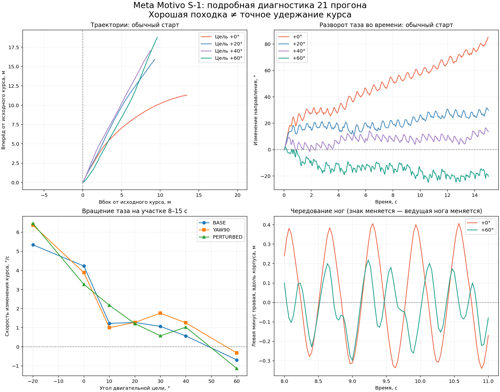

# Meta Motivo: что показали наши испытания управления движением

**Завершённая ветка исследования.** Это подробное дополнение к дневнику Local Character Lab, а не новый план тестирования Motivo.

Тесты проводились на пользовательском Windows-ПК: Intel Core i3-10100F, около 16 ГБ RAM. Модель Motivo выполнялась на CPU. В ранней диагностике зафиксированы Python 3.11.9, PyTorch 2.14.0 CPU, MuJoCo 3.13.0, NumPy 2.4.6, HumEnv 0.2.0, metamotivo 0.1.2. Это не доказательство абсолютно одинаковых зависимостей во всех исторических прогонах.

Публикуем два графика, условия испытаний и измеренные выводы. Раннюю диагностику 21 режима и последующий большой набор 79 выполненных испытаний рассматриваем отдельно. Исходные таблицы с именами ниже сохранены в полном отчёте; в это небольшое GitHub-дополнение сами CSV не включены.

Эта ветка важна не только как «неудачная попытка». Она дала методику измерений и показала, как легко спутать красивое движение, локальную реакцию и пригодность для замкнутой навигации.

### Что проверяли

Использовали готовую `facebook/metamotivo-S-1` через HumEnv/MuJoCo на CPU. В ранних сериях целевые контексты выводились из буфера 100 000 образцов. Это не новое обучение весов сети.

Не добавлялись скрытые силы стабилизации, исправления корня или принудительная постановка стоп. В отдельных диагностических условиях менялось начальное состояние; это указывается отдельно и не является постоянной коррекцией движения.

Последовательность работы включала:

1. Автоматический тест базовых движений и остановок.
2. Более строгие экспериментальные reward-функции.
3. Прямое сравнение исходного, строгого и промежуточного вариантов ходьбы.
4. Проверку небольших относительных углов двигательной цели.
5. Подробную диагностику 21 сочетания угла и начального состояния.
6. Большой ускоренный набор опубликованных поведений, импульсов, смесей, остановок и маршрутов.

### Ранние прогоны: локальная скорость не равна удержанию курса

В первой автоматической серии при целевой скорости 1 м/с измерено около 1,263 м/с после начальных трёх секунд, но направление груди за фазу ушло примерно на +67,6°. Более строгий вариант дал около 1,320 м/с, а уход направления — примерно −61,1°.

**Смена знака ошибки не равна её устранению.** Эти два запуска использовали разные экспериментальные целевые функции, поэтому их нельзя трактовать как точную статистическую оценку улучшения.

Сравнение поддержки reward в буфере было ещё одним предупреждением: для исходной ходьбы число образцов с reward > 0,5 составляло 17 301 из 100 000, для строгого варианта — 232. Это диагностический признак того, на какой части буфера строится контекст, а не процент успешных шагов или доказанная причина дефекта.

В отдельном сравнении исходной ходьбы за 20 секунд изменение направления груди достигало примерно +107,8°, при этом ноги продолжали чередоваться. Следовательно, хорошее чередование шагов не означает прямой мировой маршрут.

Исторические текстовые отчёты сохранены в отдельном полном отчёте проекта. Мы не заменяем отсутствующие данные выдуманной полной реконструкцией каждого старого прогона.

### Диагностика 21 режима

Проверены семь относительных углов: −20°, 0°, +10°, +20°, +30°, +40°, +60°, в трёх начальных условиях:

- **BASE:** исходное состояние;
- **YAW90:** поворот корня на 90° при сбросе;
- **PERTURBED:** небольшое начальное возмущение суставных скоростей, seed 123, std 0,03 рад/с.

Углы задавались относительно груди, не как фиксированный азимут мировой карты. В диагностике записывались ориентации таза/груди, траектория, скорость, контакты стоп и чередование ног.

*Иллюстрация 4. Сохранённый график ранней диагностики. Верхние панели показывают траектории и разворот таза; нижние — позднюю скорость поворота и смену ведущей ноги. Изменение угла двигательной цели влияет на движение, но это ещё не управляемая траектория к мировому объекту.*

Сводка 21 режима: `motivo_diagnostic_summary.csv`. График сохранён из исходного анализа; этот CSV не содержит всех временных рядов его верхних панелей.

Частота управляющего шага — 30 Гц; в ранней полной диагностике промежуточные физические контакты между записями не сохранялись. Скорость контактных точек включает ударные и перекатывающиеся контакты, поэтому не является чистой метрикой скольжения стоп. Высота головы — индикатор, а не полный классификатор падений.

### Большой ускоренный набор: 91 запланированное испытание

| Группа | Выполнено | Пропущено |
|---|---:|---:|
| Опорные опубликованные поведения | 9 | 0 |
| Импульсы поворота из стойки/ходьбы | 20 | 0 |
| Повороты на заданный угол | 16 | 0 |
| Постоянные профили и смеси, два стартовых направления | 28 | 0 |
| Маршрутные контроллеры | 6 | 12 |
| **Итого** | **79** | **12** |

Фактические значения пересчитаны из `motivo_suite_summary.csv`:

- 1714,133 с симуляции — около 28,57 минуты;
- сумма времени испытаний — 617,421 с, около 10,29 минуты;
- фактическое ускорение по этой сумме — около **2,78×**;
- загрузка модели и межтестовые операции в эту сумму не включены;
- минимальная высота головы в сводке — 1,323 м;
- аварий по критерию высоты головы не зарегистрировано.

В расписании было 39 минут симуляции, но 12 испытаний не выполнялись. Поэтому фраза «полностью выполнен 39-минутный тест» была бы неверной.

Ускорение меняло отношение времени симуляции к wall-clock, а не сам управляющий timestep. Большая серия сохраняла подробную телеметрию через несколько управляющих шагов, примерно 10 Гц; сама политика продолжала работать на 30 Гц.

### Постоянные смеси: улучшение есть, прямой ходьбы нет

Сравнение внутри блока profiles с одинаковой постоянной времени сглаживания 0,15 с; средние по двум начальным направлениям:

| Профиль | Скорость, м/с | Изменение курса, °/с |
|---|---:|---:|
| Исходная ходьба | 2,36 | +5,36 |
| Ходьба + standing, коэффициент 0,25 | 2,33 | +3,42 |
| Ходьба + отрицательный поворот, коэффициент 0,15 | 2,27 | +3,30 |
| Ходьба + отрицательный поворот, коэффициент 0,25 | 2,18 | +4,96 |

Коэффициент — вес в латентном пространстве, не процент физического поворота. Линейность смеси навыков не предполагается.

Лучший из перечисленных вариантов уменьшил скорость ухода примерно на 38%, но все 14 постоянных профилей имели положительный средний наклон курса. Устойчивая отрицательная дуга в проверенной сетке не найдена. Это не доказывает её отсутствия при других коэффициентах или переходных воздействиях.

Для смеси 0,15 около восьмой секунды боковое смещение было примерно −0,21 м — на первый взгляд хороший итог. Однако максимальное отклонение за первые восемь секунд было около 1,26 м, а к 24-й секунде смещение выросло примерно до +20 м. **Небольшая ошибка в одном выбранном конце интервала может скрывать кривую траекторию.**

*Иллюстрация 5. График заново построен из сохранённых измерений, с русскими подписями. Это данные большого Motivo-прогона, не синтетическая иллюстрация и не график нейросетевой анимации нынешней сцены.*

### Один импульс — разные результаты в зависимости от предыстории

Отрицательный импульс длительностью 0,15 с после ходьбы привёл примерно к −96° изменения направления груди относительно момента перед импульсом. Тот же импульс из стойки — примерно к −2,5°.

Это не только скручивание груди: изменение таза после ходьбы также велико. Но проверялась конкретная длительность входной ходьбы, а не множество независимых фаз шага. Результат показывает важность предыстории, а не универсальную функцию «0,15 с команды = 96°».

Сглаживание также оказалось не нейтральным. В двух конкретных запусках исходной ходьбы изменение направления примерно к третьей секунде было около +3,6° при прямом включении и +37,9° в сглаженном профиле. Эти два числа не заменяют серию случайных повторений, но запрещают автоматически считать сглаживание улучшением.

### Ошибка нашего прогноза торможения

Для отрицательного импульса из стойки длительностью 0,3 с направление груди при подаче STOP составляло −25,30°, а после остановки — −4,44°. Произошёл возврат примерно на **+20,86°**, а не продолжение отрицательного поворота.

В экспериментальном коде использовалось `abs(extra / omega_stop)`, затем величина `abs(omega) * brake` трактовалась как ожидаемое продолжение поворота. Знак возврата потерялся, и остановка подавалась ещё раньше.

Средняя абсолютная конечная ошибка по восьми заданным углам:

| Контроллер | Ошибка |
|---|---:|
| Пороговая остановка | 8,61° |
| Прогноз остановки | 16,67° |

Для отрицательных углов: 11,69° против 27,63°. Для положительных: 5,53° против 5,71°. **Усложнение нашего контроллера ухудшило результат.** Это не дефект, который можно честно приписать только модели.

### Почему маршруты не прошли

Выполнено шесть маршрутов stop-go: ни одна конечная цель и ни одна промежуточная точка не достигнуты. Но анализ состояния контроллера важнее самого нуля в сводке.

На прямом маршруте yaw0 из примерно 50 с активного испытания:

| Состояние | Время |
|---|---:|
| Ходьба по сегменту | 1,0 с |
| Поворот к цели | 16,0 с |
| Ожидание/выравнивание после остановки | 31,4 с |
| Прочие тормозные фазы | около 1,6 с |

Продвижение составило лишь около 1,38 м, до цели оставалось около 6,63 м. Контроллер зациклился на подготовке к ходьбе, а не полноценно проверил длительную ходьбу с коррекцией курса.

Ещё 12 маршрутов bank_gentle/bank_faster **пропущены** из-за отсутствия подходящего двунаправленного банка. Они не являются 12 дополнительными неудачными запусками. Первичная автоматическая формулировка отчёта включала пропуски в знаменатель; в публикации это исправлено.

### Почему ветку остановили

Цель проекта — получить работающего персонажа, а не бесконечно подбирать латентные смеси. К моменту остановки были найдены пригодные компоненты, измерены переходы и обнаружены ошибки контроллера, но непрерывное удобное управление не подтверждено.

Мы сменили архитектуру на перемещение корня кодом с нейросетевой адаптацией анимации. **Это инженерный выбор под проект, не вывод «Motivo не умеет двигаться» и не сравнение моделей в одинаковых условиях.** Возобновление прежней ветки сейчас не планируется.

## Источники и границы воспроизведения

- [Meta Motivo — исходная модель и код](https://github.com/facebookresearch/metamotivo).
- [Pretrained S-1](https://huggingface.co/facebook/metamotivo-S-1).
- [HumEnv](https://github.com/facebookresearch/humenv).

Числа в статье получены из наших сохранённых отчётов и телеметрии. График 21 режима сохранён из первоначального анализа; график большого набора перестроен с русскими подписями по исходным данным. Полного окружения и весов здесь нет, поэтому публикация не является готовым установщиком повторного прогона.

Код контроллеров и анализ разрабатывались с помощью ИИ-ассистента; пользователь выполнял Windows-прогоны и проверял поведение визуально. Это инженерный дневник, а не независимый стандартизованный бенчмарк. Обнаруженные ошибки нашего кода явно отделены от наблюдаемого поведения модели.

[Вернуться к проекту](README.md)
